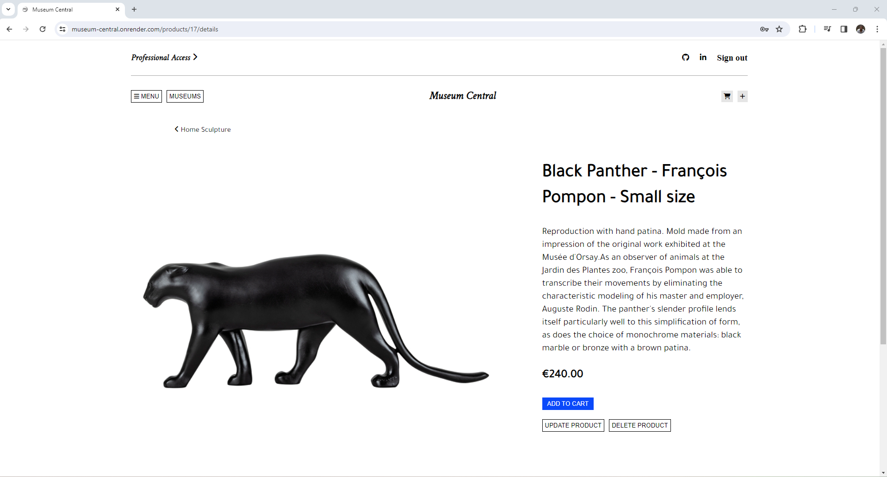

# Museum Central

Museum Central is a faithful recreation inspired by the renowned e-commerce site, [Boutiques de Musées](https://www.boutiquesdemusees.fr/en/) where users can explore their favorite museums and discover an array of exquisite products. Logged in users can seamlessly add captivating products to their cart, creating a wishlist of cultural gems, and become curators in their own right by allowing them to create and manage their virtual museums populated by unique products of their choice. Whether you're a history buff, art enthusiast, or science lover, Museum Central is your gateway to a curated collection of cultural wonders. [Click here to view the Museum Central Live Site](https://museum-central.onrender.com/)

## 🌐 Wiki Links

* [Database Schema](https://github.com/regdes721/Museum-Capstone/wiki/DB-Schema)
* [Feature List](https://github.com/regdes721/Museum-Capstone/wiki/Feature-list)
* [User Stories](https://github.com/regdes721/Museum-Capstone/wiki/User-Stories)
* [Frontend Routes](https://github.com/regdes721/Museum-Capstone/wiki/Frontend-routes)
* [React Components List](https://github.com/regdes721/Museum-Capstone/wiki/React-Components-list)
* [Wireframes](https://github.com/regdes721/Museum-Capstone/wiki/Wireframes)

## 💻 Languages and Technologies

This is a concise list of technologies utilized to develop this project.

<div>
   
   
   &nbsp;
   &nbsp;
   &nbsp;
   &nbsp;
   &nbsp;
   &nbsp;
   &nbsp;
   
</div>

## ⚙️ Getting started

1. Clone this repository (only the main branch).

2. Install dependencies.

   ```bash
   pipenv install -r requirements.txt
   ```

   to regenerate requirements.txt run `pipenv requirements > requirements.txt`

3. Create a __.env__ file based on the example with proper settings for your
   development environment.

4. Make sure the SQLite3 database connection URL is in the __.env__ file.

5. Make sure the AWS S3 credentials (bucket name, S3 key, and S3 secret key) are in the __.env__ file. If you don't have an AWS S3 bucket set up:
   1. Set up an account on [AWS](https://aws.amazon.com/)
   2. Create a new S3 bucket for your application (to store your files). Refer to [Getting started with Amazon S3](https://docs.aws.amazon.com/AmazonS3/latest/userguide/creating-bucket.html) for more details.
   3. Create a user to access the S3 bucket (this user has the necessary credentials) If you accidentally expose these credentials, you should delete the user's credentials and create new credentials. Refer to [Creating an IAM user in your AWS account](https://docs.aws.amazon.com/IAM/latest/UserGuide/id_users_create.html) for more details.

6. Make sure the Google Cloud API key to use is in the __.env__ file.

7. This project organizes all tables inside the `flask_schema` schema, defined
   by the `SCHEMA` environment variable.  Replace the value for
   `SCHEMA` with a unique name, **making sure you use the snake_case
   convention.**

8. Get into your pipenv, migrate your database, seed your database, and run your
   Flask app:

   ```bash
   pipenv shell
   ```

   ```bash
   flask db upgrade
   ```

   ```bash
   flask seed all
   ```

   ```bash
   flask run
   ```

9. To run the React frontend in development, `cd` into the __react-vite__
   directory and run `npm i` to install dependencies. Finally, run `npm run dev` to open the application on the local browser.

## 📷 Landing Page:

You will be able to test the features without sign up by clicking on the "Demo User" button in the Login Modal. You will then be directed to the landing page, where you can create a musuem, create a product for a museum that you own, or add products to your cart.





## ⚠️ Technical implementation details

* Google Maps
* AWS
  * In the backend, I set up a file with helper functions that uses environmental variables to connect to the AWS S3 Bucket and exports functions to delete from and upload images to that bucket.
  ```
   # app/aws.py

   import boto3
   import botocore
   import os
   import uuid

   ALLOWED_EXTENSIONS = {"png", "jpg", "jpeg", "gif", "svg"}
   BUCKET_NAME = os.environ.get("S3_BUCKET")
   S3_LOCATION = f"http://{BUCKET_NAME}.s3.amazonaws.com/"

   s3 = boto3.client(
      "s3",
      aws_access_key_id=os.environ.get("S3_KEY"),
      aws_secret_access_key=os.environ.get("S3_SECRET"),
      region_name="us-west-1"
   )

   def get_unique_filename(filename):
      ext = filename.rsplit(".", 1)[1].lower()
      unique_filename = uuid.uuid4().hex
      return f"{unique_filename}.{ext}"

   def upload_file_to_s3(file, acl="public-read"):
      try:
         s3.upload_fileobj(
               file,
               BUCKET_NAME,
               file.filename,
               ExtraArgs={
                "ACL": acl,
                "ContentType": file.content_type
            }
        )
      except Exception as e:
         # in case the our s3 upload fails
         return {"errors": str(e)}

    return {"url": f"{S3_LOCATION}{file.filename}"}

   def remove_file_from_s3(image_url):
      # AWS needs the image file name, not the URL,
      # so we split that out of the URL
      key = image_url.rsplit("/", 1)[1]
      try:
         s3.delete_object(
         Bucket=BUCKET_NAME,
         Key=key
        )
      except Exception as e:
         return { "errors": str(e) }
      return True


  ```
  * In the creation, edit, and deletion routes for museums and products, I call these helper functions when appropriate
     * Note: one issue I ran into was in my create product backend route, where I seemingly wasn't able to create a preview image for the newly created product since the product id passed into the new Product Image instance always ended up being null. I resolved this issue by refactoring the create product backend route so that the the newly created product is added and committed to the database before the preview image creation was attempted within the same route.
   ```
   # app/api/product_routes.py

   @product_routes.route('', methods=['POST'])
   @login_required
   def create_product():
      form = ProductForm()
      form['csrf_token'].data = request.cookies['csrf_token']
      if form.validate_on_submit():
         data = form.data
         new_product = Product(
               museum_id = data["museum_id"],
               name = data["name"],
               description = data["description"],
               price = data["price"],
               category = data["category"],
               dimensions = data["dimensions"],
               quantity = data["quantity"]
         )
         db.session.add(new_product)
         db.session.commit()
         new_product_image = ProductImage(
               product_id = new_product.id,
               image_url = data["image_url"],
               preview = True
         )
         db.session.add(new_product_image)
         db.session.commit()
         return new_product.to_dict()
      return {'errors': form.errors}, 400
   ```

## ⏩ Future Features
* Account Page
* Orders
* Media Queries
* Search
